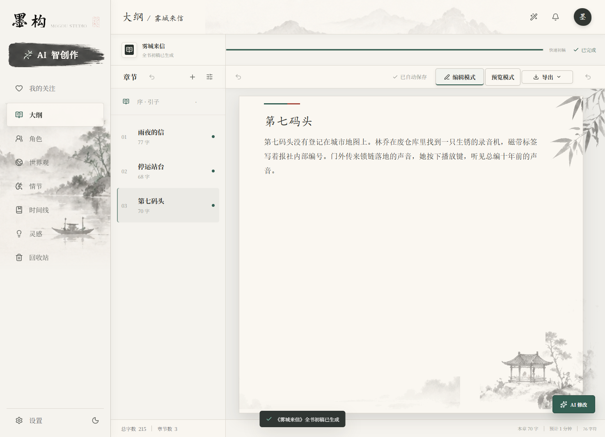
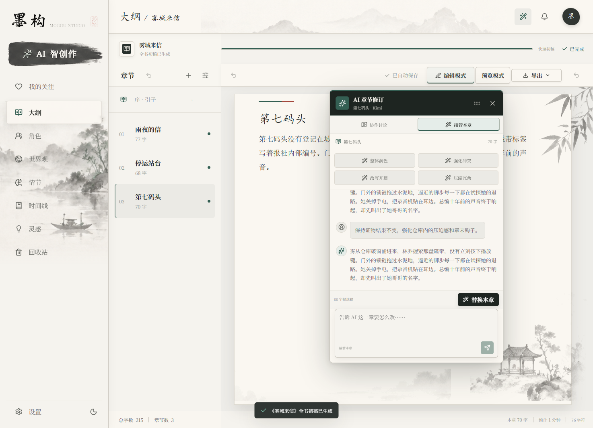
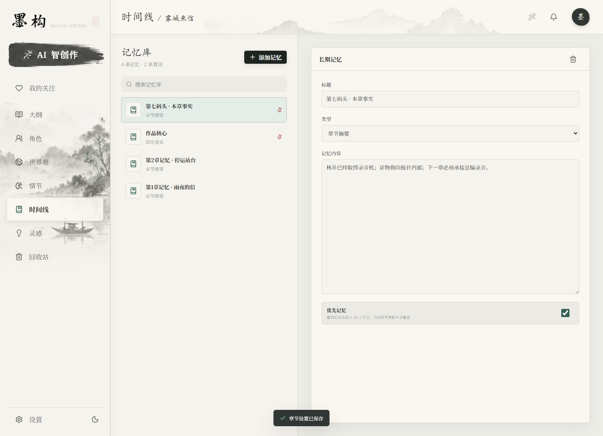

<div align="center">
  
  <h1>InkForge AI</h1>
  <p><strong>让灵感，长成一部作品。</strong></p>
  <p>一套为长篇小说而生的 AI 创作工作台。<br />从一句念头，到一条完整、连贯、可持续的故事线。</p>

  <p>
    <a href="#快速开始">快速开始</a> ·
    <a href="#创作闭环">创作闭环</a> ·
    <a href="#ai-协作方式">AI 协作方式</a> ·
    <a href="#隐私与数据">隐私与数据</a>
  </p>

  <p>
    
    
    
    
  </p>
</div>

<br />

<div align="center">
  
</div>

<br />

## 不是另一个聊天框

长篇写作真正难的，从来不是“写出一段话”。

难的是：写到第三十章时，角色仍然像他自己；写到故事后半程时，伏笔仍然有回声；灵感不断涌来时，作品不会被碎片淹没。

**墨构把 AI 从一次性生成器，变成一套能陪你走完全程的创作系统。**

你负责想象、判断和取舍；墨构负责整理上下文、展开可能性、执行写作流程，并在每一个章节节点帮你保持故事的方向感。

## 创作闭环

<table>
  <tr>
    <td width="25%"><strong>01 · 种下灵感</strong><br /><sub>一句话、一个画面，或一个挥之不去的问题。</sub></td>
    <td width="25%"><strong>02 · 建立世界</strong><br /><sub>人物、规则、关系与命运开始彼此咬合。</sub></td>
    <td width="25%"><strong>03 · 展开章节</strong><br /><sub>目标、阻力、代价与章末钩子清晰可见。</sub></td>
    <td width="25%"><strong>04 · 留下笔迹</strong><br /><sub>AI 扩展可能性，你决定故事最终的方向。</sub></td>
  </tr>
</table>

## 你真正得到的

<table>
  <tr>
    <td width="33%" valign="top">
      <h3>✦ 一键展开整部小说</h3>
      <p>从核心创意出发，生成作品定位、角色、世界观、主线、支线与分章大纲。不是随机拼接，而是一条有因果的故事线。</p>
    </td>
    <td width="33%" valign="top">
      <h3>◌ 记得住的故事大脑</h3>
      <p>角色、时间线、伏笔、设定事实与章节记忆集中沉淀。写到长篇后半程，也不会丢掉最初的那束光。</p>
    </td>
    <td width="33%" valign="top">
      <h3>↗ 每一章都值得发布</h3>
      <p>写作、审读、修订、终审四段质量流程，让灵感落地时依然有节奏、有张力、有完成度。</p>
    </td>
  </tr>
</table>

## AI 协作方式

AI 不应该在你没有确认的情况下改掉你的正文。因此，墨构把“讨论”和“执行”明确分开：

| 工作方式 | 你可以做什么 | 正文是否自动改变 |
| --- | --- | --- |
| **智能对话** | 讨论开篇、节奏、人物动机、场景扩写和一致性问题 | **不会** |
| **接管本章** | 根据你的要求生成完整候选修订稿，预览后决定是否应用 | **确认后才会** |

接管修订时，原文会自动保留为可恢复版本。你可以大胆试错，也可以随时回到上一版。

## 一章的完整质量流程

```text
核心创意
   ↓
作品设定 · 角色关系 · 世界规则 · 章节目标
   ↓
分章写作 ──→ AI 审读 ──→ 系统修订 ──→ 发布终审
   │             │             │             │
   └────── 每个阶段都可暂停、查看、调整与恢复 ──────┘
```

可选模式：

| 模式 | 适合场景 | 调用流程 |
| --- | --- | --- |
| **快速初稿** | 快速铺开故事骨架 | 大纲规划 → 分章写作 |
| **标准成稿** | 日常连载与稳定产出 | 写作 → 审读 → 系统修订 |
| **番茄发布版** | 发布前的完整检查 | 写作 → 审读 → 修订 → 发布终审 |

## 工作台一览

<div align="center">
  
  
</div>

<br />

| 模块 | 作用 |
| --- | --- |
| **章节编辑器** | 在沉浸式正文区域中写作、预览、统计字数与设置目标 |
| **角色库** | 管理角色身份、动机、冲突、标签与关系变化 |
| **世界观** | 沉淀地点、规则、历史、势力与关键物件 |
| **情节与灵感** | 记录主线、支线、伏笔、转折、对白与场景 |
| **记忆系统** | 保存设定事实、人物关系、时间线与章节摘要 |
| **章节 AI** | 在当前上下文中对话、续写、审阅或生成修订稿 |

## 视觉与体验

墨构的界面像一间安静、专业的私人工作室，而不是信息拥挤的后台：

- 编辑器式章节工作台，正文、章节状态与 AI 面板协同工作
- 浅色 / 深色主题，适合白天写作与夜间沉浸
- 桌面端与移动端自适应
- 可拖拽的章节 AI 面板，适合边读边改
- 进度、目标字数、保存状态与生成阶段清晰可见
- 新用户打开即见产品介绍，不需要先理解复杂菜单

## 隐私与数据

**Local-first · 你的故事，默认只留在你的浏览器里。**

- 作品数据默认保存于浏览器本地存储
- API Key 仅保存在当前浏览器的应用设置中
- 不会把 API Key 写入仓库文件
- 支持完整导出与导入，方便备份与迁移

> 更换浏览器、清理站点数据或重装系统前，请先在「设置」中导出备份。

## 快速开始

### 环境要求

- Node.js 18+
- pnpm 10+

### 启动开发环境

```bash
pnpm install
pnpm dev
```

打开终端显示的本地地址，默认通常为：

```text
http://127.0.0.1:5173
```

### 构建与预览

```bash
pnpm build
pnpm preview
```

### 配置 AI 模型

启动应用后进入「设置」，选择提供商并填写接口地址、API Key 与模型名称。当前内置配置入口包括：

- DeepSeek
- OpenAI
- Kimi

## 开发检查

```bash
pnpm typecheck
pnpm build
pnpm verify:ui
```

## 项目结构

```text
src/
├── App.tsx       # 应用界面、工作台与交互流程
├── ai.ts         # AI 请求与流式响应
├── data.ts       # 作品、章节与默认数据模型
├── storage.ts    # 本地保存、导入与导出
├── types.ts      # TypeScript 类型定义
├── workflows.ts  # 写作、审读、修订与终审提示词
└── styles.css    # 全局主题与响应式界面样式
```

## 技术栈

`React 19` · `TypeScript 5` · `Vite 5` · `lucide-react` · `pnpm`

<br />

<div align="center">
  <strong>故事不会因为复杂而失去方向。</strong><br />
  <sub>InkForge AI · MOGOU STUDIO</sub>
</div>
