<div align="center">



<br />

# InkForge AI · 墨构

**让灵感，长成一部作品。**

长篇小说的 AI 创作工作台。墨构会记得人物、世界、伏笔和每一次修改，让故事从第一句灵感一路保持方向。

<a href="#快速开始">开始创作</a>&nbsp;&nbsp;·&nbsp;&nbsp;<a href="#为什么是墨构">产品理念</a>&nbsp;&nbsp;·&nbsp;&nbsp;<a href="#创作系统">创作系统</a>&nbsp;&nbsp;·&nbsp;&nbsp;<a href="#本地优先">本地优先</a>

<br />


</div>

<br />

## 为什么是墨构

写长篇，难的不是生成一段文字。

难的是写到第三十章时，角色仍然像他自己；写到故事后半程时，伏笔仍然有回声；灵感不断涌来时，作品不会被碎片淹没。

**墨构不是一次性文本生成器。它是一套记得住故事的创作系统。**

你决定故事的方向。墨构负责保存上下文、展开可能性、执行章节流程，并把每一次 AI 修改留在可回退的轨迹里。

<table>
  <tr>
    <td align="center" width="33%"><strong>STORY ENGINE</strong><br /><sub>从一句灵感，展开为可执行的故事线</sub></td>
    <td align="center" width="33%"><strong>MEMORY LAYER</strong><br /><sub>人物、设定、时间线和伏笔持续连贯</sub></td>
    <td align="center" width="33%"><strong>QUALITY LOOP</strong><br /><sub>写作、审读、修订与终审逐章发生</sub></td>
  </tr>
</table>

## 创作现场

<div align="center">
  
</div>

墨构将作品、章节、角色、世界观、情节、灵感与时间线放在同一间安静的工作室里。生成正文时，光标自动跟随最新内容；当你手动回看旧段落，跟随会暂停，直到你选择回到此刻。

## 创作系统

```text
一个念头
   ↓
故事设定 · 人物关系 · 世界规则 · 章节节拍
   ↓
分章写作 ──→ AI 审读 ──→ 系统修订 ──→ 发布终审
   │             │             │             │
   └──────── 每一步都可查看、调整与回退 ────────┘
```

<table>
  <tr>
    <td width="25%" valign="top"><strong>01 · 种下灵感</strong><br /><sub>一句话、一个画面，或一个未解的问题。</sub></td>
    <td width="25%" valign="top"><strong>02 · 长出世界</strong><br /><sub>人物、规则、关系与命运彼此咬合。</sub></td>
    <td width="25%" valign="top"><strong>03 · 展开章节</strong><br /><sub>目标、阻力、代价与钩子清晰可见。</sub></td>
    <td width="25%" valign="top"><strong>04 · 留下笔迹</strong><br /><sub>AI 给出可能性，你决定最终方向。</sub></td>
  </tr>
</table>

### 章节 AI：只在你允许的范围内工作

| 模式 | 做什么 | 写入范围 |
| --- | --- | --- |
| **智能对话** | 讨论节奏、人物动机、场景和一致性 | 不会修改正文 |
| **接管本章** | 生成完整候选修订稿，供你确认 | 仅当前章节 |
| **续写正文** | 延续当前章节的叙事和文风 | 仅追加到当前章节 |

每本书、每个章节的 AI 对话和操作都保存在本地。修订、续写和恢复都会留下记录，随时可以回退。

<div align="center">
  
  
</div>

## 一座属于你的作品空间

首页为每本书保留独立入口，同时呈现：

- 今日 Token、AI 产出字数和全局总字数
- 当前实际运行的模型与累计模型用量
- 每部作品的章节进度、字数、最后更新与独立删除入口
- 本地保存的 AI 记忆、操作历史与回退版本

## 本地优先

> **你的故事，默认只留在你的浏览器里。**

- 作品、章节、记忆、用量记录和回退版本保存在本地
- API Key 仅保存在当前浏览器的应用设置中
- 支持完整导入与导出，方便备份与迁移
- 更换浏览器或清理站点数据前，请先导出备份

## 快速开始

环境要求：Node.js 18+，pnpm 10+。

```bash
pnpm install
pnpm dev
```

默认访问地址：`http://127.0.0.1:5173`

<details>
<summary><strong>构建、模型与开发说明</strong></summary>

<br />

生产构建与预览：

```bash
pnpm build
pnpm preview
```

开发检查：

```bash
pnpm typecheck
pnpm verify:ui
```

在应用「设置」中可以配置 DeepSeek、OpenAI 或 Kimi 的接口地址、API Key 与模型名称。

核心技术：`React 19` · `TypeScript 5` · `Vite 5` · `lucide-react` · `pnpm`

</details>

<br />

<div align="center">

**故事不会因为复杂而失去方向。**

<sub>INKFORGE AI / MOGOU STUDIO</sub>

</div>
